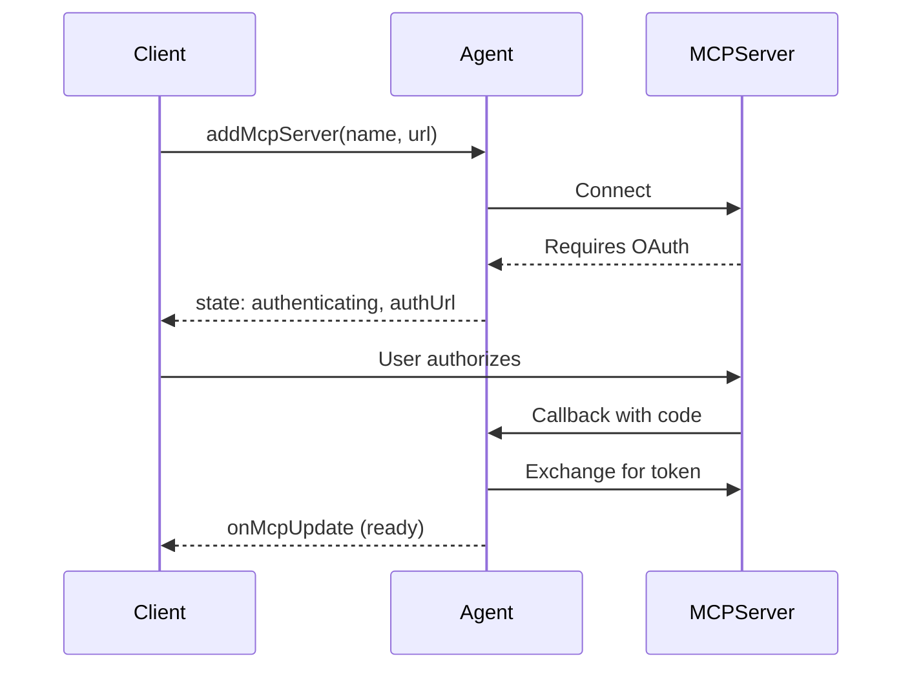

# Connecting to MCP Servers

Connect your agent to external MCP (Model Context Protocol) servers to use their tools, resources, and prompts. This enables your agent to interact with GitHub, Slack, databases, and other services through a standardized protocol.

## Overview

The MCP client capability lets your agent:

- **Connect to external MCP servers** - GitHub, Slack, databases, AI services
- **Use their tools** - Call functions exposed by MCP servers
- **Access resources** - Read data from MCP servers
- **Use prompts** - Leverage pre-built prompt templates

> **Note:** This page covers connecting to MCP servers as a client. To create your own MCP server, see [Creating MCP Servers](./mcp-servers.md).

## Quick Start

Install the exact MCP client peer used by this Agents release:

```sh
pnpm add agents @modelcontextprotocol/client@2.0.0
```

```typescript
import { Agent } from "agents";

export class MyAgent extends Agent {
  async onRequest(request: Request) {
    // Add an MCP server
    const result = await this.addMcpServer(
      "github",
      "https://mcp.github.com/mcp"
    );

    if (result.state === "authenticating") {
      // Server requires OAuth - redirect user to authorize
      return Response.redirect(result.authUrl);
    }

    // Server is ready - tools are now available
    const state = this.getMcpServers();
    console.log(`Connected! ${state.tools.length} tools available`);

    return new Response("MCP server connected");
  }
}
```

## Adding MCP Servers

Use `addMcpServer()` to connect to an MCP server:

```typescript
const result = await this.addMcpServer(name, url, options?);
```

### Basic Usage

```typescript
// Simple connection
await this.addMcpServer("notion", "https://mcp.notion.so/mcp");

// With explicit callback host (rarely needed — auto-derived from request or WebSocket URI)
await this.addMcpServer("github", "https://mcp.github.com/mcp", {
  callbackHost: "https://my-worker.workers.dev"
});
```

### Transport Options

MCP supports multiple transport types:

```typescript
await this.addMcpServer("server", "https://mcp.example.com/mcp", {
  transport: {
    // Transport type: "streamable-http" (default), "sse", or "auto"
    type: "streamable-http"
  }
});
```

| Transport           | Description                                           |
| ------------------- | ----------------------------------------------------- |
| `"streamable-http"` | HTTP with streaming - recommended default             |
| `"sse"`             | Server-Sent Events - legacy / compatibility transport |
| `"auto"`            | Auto-detect based on server response                  |

### Custom Headers

For servers behind authentication (like Cloudflare Access) or using bearer tokens:

```typescript
await this.addMcpServer("internal", "https://internal-mcp.example.com/mcp", {
  transport: {
    headers: {
      Authorization: "Bearer my-token",
      "CF-Access-Client-Id": "...",
      "CF-Access-Client-Secret": "..."
    }
  }
});
```

### Legacy OAuth metadata compatibility

SDK v2 validates authorization-server metadata issuers by default. A trusted Legacy server with known mismatched RFC 8414 metadata can opt out explicitly:

```typescript
await this.addMcpServer("legacy", "https://legacy.example.com/mcp", {
  transport: {
    skipIssuerMetadataValidation: true
  }
});
```

This weakens OAuth mix-up protection. Do not enable it for unknown servers or as a general fallback.

### Retry Options

Configure retry behavior for connection and reconnection attempts:

```typescript
await this.addMcpServer("github", "https://mcp.github.com/mcp", {
  retry: {
    maxAttempts: 5,
    baseDelayMs: 1000,
    maxDelayMs: 10000
  }
});
```

These options are persisted and used when reconnecting after hibernation or after OAuth completion. Default: 3 attempts, 500ms base delay, 5s max delay. See [Retries](./retries.md) for more details.

### Protocol negotiation and elicitation

Agents uses the MCP v2 client and automatically negotiates the protocol version for every connection. It uses `server/discover` with Stateless servers and falls back to the `initialize` handshake on the same connection for Legacy Streamable HTTP, SSE, and RPC servers.

MCP servers can request input from the client during `callTool`, `getPrompt`, or `readResource`. Stateless Elicitation returns an `input_required` result and completes through MRTR: the MCP SDK invokes the configured `elicitation/create` handler, sends its response, and continues the original request. Agents does not expose an intermediate continuation; the original call stays pending while human input is collected and eventually resolves to the ordinary tool, prompt, or resource result. Legacy Elicitation on Legacy servers continues to use pushed `elicitation/create` requests. Both generations share the same handlers.

Configure elicitation handlers before MCP connections are registered or restored:

```typescript
import { Agent } from "agents";

class MyAgent extends Agent<Env> {
  onStart() {
    this.mcp.configureElicitationHandlers({
      url: async (request, serverId) => {
        // Deliver a url-mode elicitation link out-of-band
        return { action: "accept" as const, content: {} };
      },
      form: async (request, serverId) => {
        // Collect values matching request.params.requestedSchema
        return { action: "accept" as const, content: {} };
      }
    });
  }
}
```

The advertised modes are persisted with each MCP server, so a connection restored from storage after hibernation re-advertises the same modes at the handshake; the handlers themselves re-attach when `onStart()` runs. Configuring a handler after an MCP connection is already active updates the in-memory handler, but the server only sees new advertised elicitation modes after that connection reconnects.

Handlers and pending calls are memory-only. A Durable Object hibernation or isolate restart does not preserve an in-flight interactive call; callers must retry it after the connection is restored. Agents intentionally does not persist in-flight Stateless `requestState` or implement a manual/resumable continuation layer.

Connections advertise only the elicitation modes with configured handlers at the `initialize` handshake: configure `form` to advertise form-mode elicitation, `url` to advertise url-mode elicitation (MCP spec 2025-11-25 — url mode is used for sensitive flows like OAuth URLs), or both to advertise both modes. Without handlers, connections advertise no elicitation capability, so spec-compliant servers use their non-elicitation fallbacks instead of sending requests the agent cannot answer.

To override the advertised modes, declare them explicitly — an explicit declaration always wins and is persisted with the server options, surviving hibernation:

```typescript
await this.addMcpServer("portal", "https://portal.example.com/mcp", {
  client: {
    capabilities: {
      elicitation: { form: {} } // form-mode only, even with both handlers configured
    }
  }
});
```

### URL Security

MCP server URLs are validated before connection to prevent Server-Side Request Forgery (SSRF). The following URL targets are blocked:

- Private/internal IP ranges (RFC 1918: `10.x`, `172.16-31.x`, `192.168.x`)
- Unspecified addresses (`0.0.0.0`, `::`)
- Link-local addresses (`169.254.x`, `fe80::`)
- Cloud metadata endpoints (`169.254.169.254`)
- IPv6 unique-local addresses (`fc00::/7`)

Loopback development URLs such as `localhost`, `127.0.0.1`, and `::1` are allowed.

If you need to connect to another internal MCP server, use the [RPC transport](./mcp-transports.md) with a Durable Object binding instead of HTTP.

### Return Value

`addMcpServer()` returns the connection state:

```typescript
type AddMcpServerResult =
  | { id: string; state: "ready" }
  | { id: string; state: "authenticating"; authUrl: string };
```

- **`ready`** - Server connected and tools discovered
- **`authenticating`** - Server requires OAuth; redirect user to `authUrl`

## OAuth Authentication

Many MCP servers require OAuth authentication. The agent handles the OAuth flow automatically.

### How It Works



### Handling OAuth in Your Agent

```typescript
async onRequest(request: Request) {
  const result = await this.addMcpServer("github", "https://mcp.github.com/mcp");

  if (result.state === "authenticating") {
    // Option 1: Redirect the user
    return Response.redirect(result.authUrl);

    // Option 2: Return the URL for client-side redirect
    return Response.json({
      status: "needs_auth",
      authUrl: result.authUrl
    });
  }

  return Response.json({ status: "connected", id: result.id });
}
```

### OAuth Callback

The callback URL is automatically constructed:

```
https://{host}/{agentsPrefix}/{agent-name}/{instance-name}/callback
```

For example: `https://my-worker.workers.dev/agents/my-agent/default/callback`

OAuth tokens are securely stored in SQLite and persist across agent restarts.

### Custom Callback Handling

For custom OAuth completion behavior:

```typescript
// In your agent constructor or onStart
this.mcp.configureOAuthCallback({
  // Redirect after successful auth
  successRedirect: "https://myapp.com/success",

  // Redirect on error
  errorRedirect: "https://myapp.com/error",

  // Or use a custom handler
  customHandler: (result) => {
    return new Response(
      JSON.stringify({
        success: result.authSuccess,
        serverId: result.serverId,
        error: result.authError
      }),
      {
        headers: { "Content-Type": "application/json" }
      }
    );
  }
});
```

### Custom OAuth Provider

By default, agents use dynamic client registration to authenticate with MCP servers. If you need to use a different OAuth strategy — such as pre-registered client credentials, mTLS-based authentication, or other mechanisms — override the `createMcpOAuthProvider` method in your agent subclass:

```typescript
import { Agent } from "agents";
import type { AgentMcpOAuthProvider } from "agents";

class MyAgent extends Agent {
  createMcpOAuthProvider(callbackUrl: string): AgentMcpOAuthProvider {
    return new MyCustomOAuthProvider(this.ctx.storage, this.name, callbackUrl);
  }
}
```

Your custom class must implement the `AgentMcpOAuthProvider` interface, which extends the MCP SDK's `OAuthClientProvider` with additional properties (`authUrl`, `clientId`, `serverId`) and methods (`checkState`, `consumeState`, `deleteCodeVerifier`) used by the agent's MCP connection lifecycle.

The override is used for both new connections (`addMcpServer`) and restored connections after a Durable Object restart, so your custom provider is always used consistently.

#### Custom storage backend

The most common customization is using a different storage backend while keeping the built-in OAuth logic (CSRF state, PKCE, nonce generation, token management). Import `DurableObjectOAuthClientProvider` and pass your own storage adapter:

```typescript
import { Agent, DurableObjectOAuthClientProvider } from "agents";
import type { AgentMcpOAuthProvider } from "agents";

class MyAgent extends Agent {
  createMcpOAuthProvider(callbackUrl: string): AgentMcpOAuthProvider {
    return new DurableObjectOAuthClientProvider(
      myCustomStorage, // any DurableObjectStorage-compatible adapter
      this.name,
      callbackUrl
    );
  }
}
```

## Using MCP Capabilities

Once connected, access the server's capabilities:

### Getting Available Tools

Use `listTools()` when you need to discover or inspect the raw MCP catalog without preparing tools for an AI SDK model call:

```typescript
const tools = this.mcp.listTools();

for (const tool of tools) {
  console.log(`Tool: ${tool.name}`);
  console.log(`  From server: ${tool.serverId}`);
  console.log(`  Description: ${tool.description}`);
}
```

`getMcpServers().tools` exposes the same raw tool shape as part of the full client state sent to connected applications. Neither API converts JSON Schemas to Zod.

### Resources and Prompts

```typescript
const state = this.getMcpServers();

// Available resources
for (const resource of state.resources) {
  console.log(`Resource: ${resource.name} (${resource.uri})`);
}

// Available prompts
for (const prompt of state.prompts) {
  console.log(`Prompt: ${prompt.name}`);
}
```

### Server Status

```typescript
const state = this.getMcpServers();

for (const [id, server] of Object.entries(state.servers)) {
  console.log(`${server.name}: ${server.state}`);
  // state: "ready" | "authenticating" | "connecting" | "connected" | "discovering" | "failed"
}
```

### Integration with AI SDK

To use MCP tools with the Vercel AI SDK, use `this.mcp.getAITools()` which converts MCP tools to AI SDK format:

```typescript
import { generateText } from "ai";

async function chat(prompt: string) {
  const response = await generateText({
    model: openai("gpt-4"),
    prompt,
    tools: this.mcp.getAITools() // Converts MCP tools to AI SDK format
  });

  return response;
}
```

> **Note:** Use `this.mcp.listTools()` or `getMcpServers().tools` for discovery and inspection. Call `this.mcp.getAITools()` only when preparing tools for the AI SDK because it converts each MCP input and output JSON Schema to Zod.

### AI tool schema conversion lifetime

`getAITools()` reuses converted schemas while a live connection keeps the same current catalog. Repeated filtered or unfiltered calls still return fresh tool records and execute closures. Connections excluded by a filter are not converted.

The next call converts schemas again after discovery replaces a catalog or the live connection changes. If a custom integration mutates a schema, assign a new `inputSchema` or `outputSchema` object, or replace the catalog array, so `getAITools()` detects the change.

## Managing Servers

### Removing a Server

```typescript
await this.removeMcpServer(serverId);
```

This disconnects from the server and removes it from storage.

### Persistence

MCP servers persist across agent restarts:

- Server configuration stored in SQLite
- OAuth tokens stored securely
- Connections restored automatically when agent wakes

### Listing All Servers

```typescript
const state = this.getMcpServers();

for (const [id, server] of Object.entries(state.servers)) {
  console.log(`${id}: ${server.name} (${server.server_url})`);
}
```

## Client-Side Integration

Connected clients receive real-time MCP updates via WebSocket:

```typescript
import { useAgent } from "agents/react";

function Dashboard() {
  const [tools, setTools] = useState([]);
  const [servers, setServers] = useState({});

  const agent = useAgent({
    agent: "MyAgent",
    onMcpUpdate: (mcpState) => {
      setTools(mcpState.tools);
      setServers(mcpState.servers);
    },
  });

  return (
    <div>
      <h2>Connected Servers</h2>
      {Object.entries(servers).map(([id, server]) => (
        <div key={id}>
          {server.name}: {server.connectionState}
        </div>
      ))}

      <h2>Available Tools ({tools.length})</h2>
      {tools.map((tool) => (
        <div key={`${tool.serverId}-${tool.name}`}>{tool.name}</div>
      ))}
    </div>
  );
}
```

## Advanced: MCPClientManager

For fine-grained control, use `this.mcp` directly:

### Step-by-Step Connection

```typescript
// 1. Register the server (saves to storage and creates in-memory connection)
const id = "my-server";
await this.mcp.registerServer(id, {
  url: "https://mcp.example.com/mcp",
  name: "My Server",
  callbackUrl: "https://my-worker.workers.dev/agents/my-agent/default/callback",
  transport: { type: "auto" }
});

// 2. Connect (initializes transport, handles OAuth if needed)
const connectResult = await this.mcp.connectToServer(id);

if (connectResult.state === "failed") {
  console.error("Connection failed:", connectResult.error);
  return;
}

if (connectResult.state === "authenticating") {
  console.log("OAuth required:", connectResult.authUrl);
  return;
}

// 3. Discover capabilities (transitions from "connected" to "ready")
if (connectResult.state === "connected") {
  const discoverResult = await this.mcp.discoverIfConnected(id);

  if (!discoverResult?.success) {
    console.error("Discovery failed:", discoverResult?.error);
  }
}
```

### Event Subscription

```typescript
// Listen for state changes (onServerStateChanged is an Event<void>)
const disposable = this.mcp.onServerStateChanged(() => {
  console.log("MCP server state changed");
  this.broadcastMcpServers(); // Notify connected clients
});

// Clean up the subscription when no longer needed
// disposable.dispose();
```

### Waiting for Connections

After hibernation or when connections are being restored in the background, MCP tools may not be immediately available. Use `waitForConnections()` to wait until all in-flight connection and discovery operations have settled:

```typescript
// Wait indefinitely for all connections to be ready
await this.mcp.waitForConnections();

// Wait with a timeout (in milliseconds)
await this.mcp.waitForConnections({ timeout: 10_000 });
```

This is useful when you need to call `this.mcp.getAITools()` immediately after the agent wakes from hibernation. Without waiting, tools from servers that are still reconnecting will be missing.

> **Note:** `AIChatAgent` handles this automatically via the `waitForMcpConnections` property (defaults to `{ timeout: 10_000 }`). You only need `waitForConnections()` directly when using `Agent` with MCP, or when you want finer control inside `onChatMessage`.

### Error Recovery

```typescript
async retryConnection(serverId: string) {
  const result = await this.mcp.connectToServer(serverId);

  if (result.state === "connected") {
    await this.mcp.discoverIfConnected(serverId);
  } else if (result.state === "failed") {
    console.error("Reconnection failed:", result.error);
  }
}
```

## Examples

### MCP Client Demo

The [`examples/mcp-client`](https://github.com/cloudflare/agents/tree/main/examples/mcp-client) example demonstrates:

- Adding and removing MCP servers dynamically
- Custom OAuth callback handling (popup-closing behavior)
- Listing tools from connected servers
- Real-time state updates to the frontend

```typescript
// From examples/mcp-client/src/server.ts
export class MyAgent extends Agent {
  onStart() {
    // Custom OAuth callback that closes the popup window
    this.mcp.configureOAuthCallback({
      customHandler: (result) => {
        if (result.authSuccess) {
          return new Response("<script>window.close();</script>", {
            headers: { "content-type": "text/html" }
          });
        }
        // Handle error...
      }
    });
  }

  async onRequest(request: Request) {
    const url = new URL(request.url);

    if (url.pathname.endsWith("add-mcp")) {
      const { name, url } = await request.json();
      await this.addMcpServer(name, url);
      return new Response("Ok");
    }
    // ...
  }
}
```

## API Reference

### addMcpServer()

```typescript
// HTTP transport (Streamable HTTP, SSE)
async addMcpServer(
  name: string,
  url: string,
  options?: {
    callbackHost?: string;  // auto-derived from request or WebSocket connection URI; only set to override
    callbackPath?: string;  // custom callback URL path (bypasses default /agents/{class}/{name}/callback)
    agentsPrefix?: string;
    client?: ClientOptions;
    transport?: {
      headers?: HeadersInit;
      type?: "sse" | "streamable-http" | "auto"; // default: "auto"
    };
    retry?: RetryOptions; // retry options for connection/reconnection
  }
): Promise<
  | { id: string; state: "ready" }
  | { id: string; state: "authenticating"; authUrl: string }
>

// RPC transport (Durable Object binding — no HTTP overhead)
async addMcpServer(
  name: string,
  binding: DurableObjectNamespace,
  options?: {
    props?: Record<string, unknown>; // passed to the McpAgent's onStart(props)
    client?: ClientOptions;
    retry?: RetryOptions;
  }
): Promise<{ id: string; state: "ready" }>

// Legacy signature (still supported)
async addMcpServer(
  name: string,
  url: string,
  callbackHost?: string,
  agentsPrefix?: string,
  options?: { ... }
): Promise<...>
```

Add and connect to an MCP server. Throws if connection or discovery fails.

`callbackHost` is automatically derived from the incoming HTTP request or WebSocket connection URI — you almost never need to set it explicitly. It is only needed when the auto-detected host does not match your desired OAuth callback origin (for example, behind a reverse proxy). For RPC transport, pass a `DurableObjectNamespace` binding instead of a URL. See [MCP Transports](./mcp-transports.md) for details.

Calling `addMcpServer` is idempotent when both the server name **and** URL match an existing active connection — the existing connection is returned without creating a duplicate. This makes it safe to call in `onStart()` without worrying about duplicate connections on restart.

If you call `addMcpServer` with the same name but a **different** URL, a new connection is created. Both connections remain active and their tools are merged in `getAITools()`. To replace a server, call `removeMcpServer(oldId)` first.

> **Note:** URLs are normalized before comparison (trailing slashes, default ports, and hostname case are handled), so `https://MCP.Example.com` and `https://mcp.example.com/` are treated as the same URL.

### removeMcpServer()

```typescript
async removeMcpServer(id: string): Promise<void>
```

Disconnect from and remove an MCP server.

### getMcpServers()

```typescript
getMcpServers(): MCPServersState
```

Get the current state of all MCP servers and their capabilities.

### MCPServersState

```typescript
type MCPServersState = {
  servers: {
    [id: string]: MCPServer;
  };
  tools: (Tool & { serverId: string })[];
  prompts: (Prompt & { serverId: string })[];
  resources: (Resource & { serverId: string })[];
};
```

### MCPServer

```typescript
type MCPServer = {
  name: string;
  server_url: string;
  auth_url: string | null;
  state:
    | "ready"
    | "authenticating"
    | "connecting"
    | "connected"
    | "discovering"
    | "failed";
  error: string | null;
  instructions: string | null;
  capabilities: ServerCapabilities | null;
};
```
