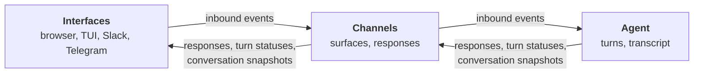
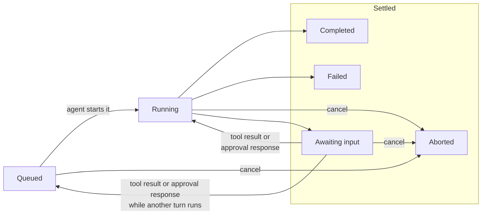
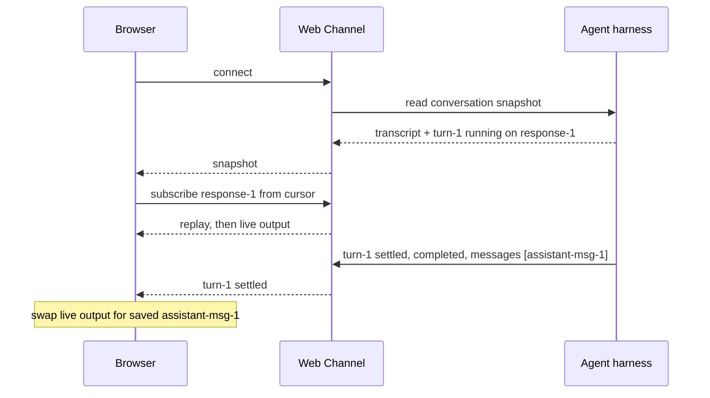
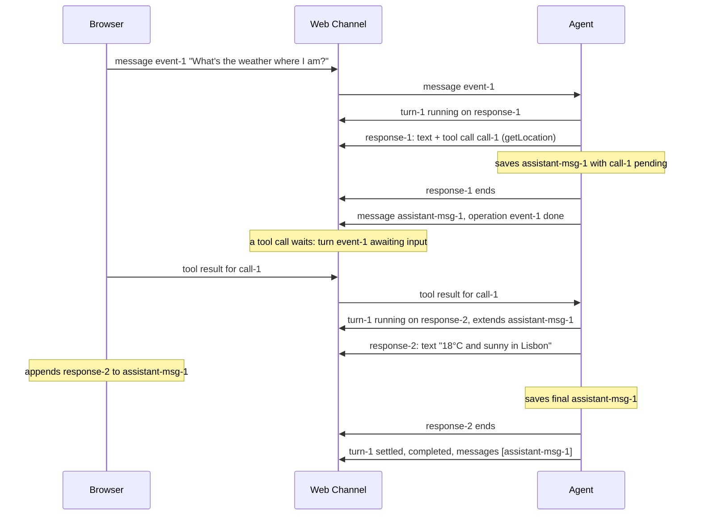
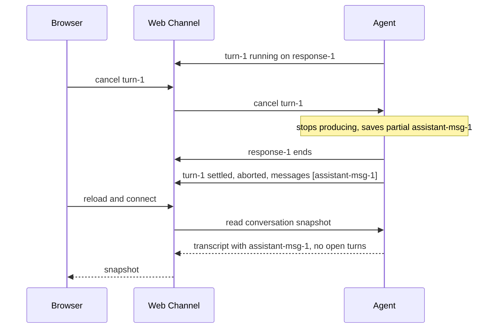
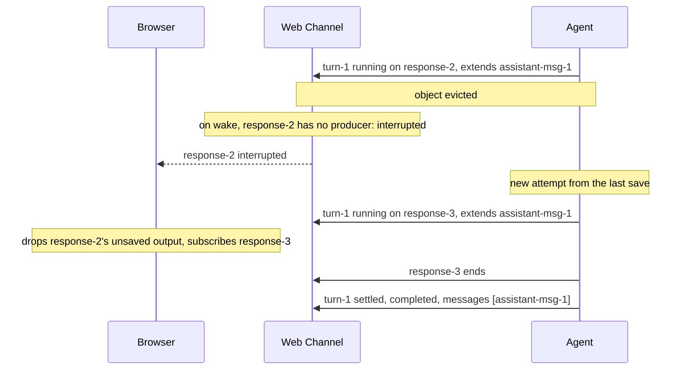
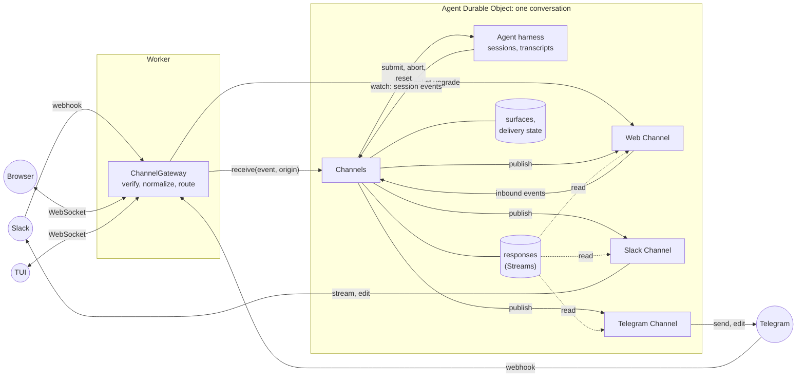
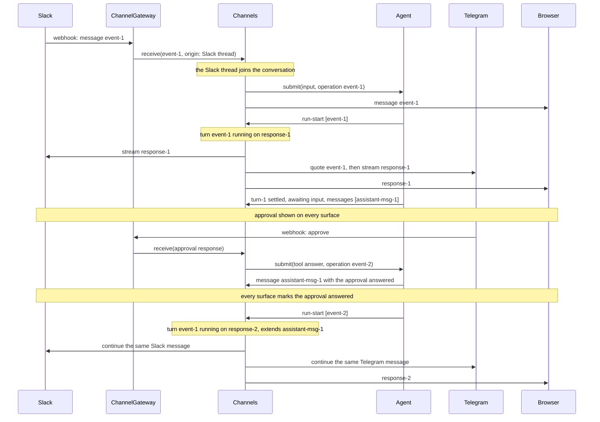

# Channels diagrams

Terms are defined in [CONTEXT.md](./CONTEXT.md).

## Layers

The agent owns turns and the transcript. Channels carries inbound events in and responses, turn statuses and snapshots out.

## Turn status

Queued, running or settled. Only a turn awaiting input can run again. Its continuation queues if another turn is running.

## Connecting mid-turn

The surface listens for turn statuses before it reads the snapshot, so nothing published in between is lost.

## Client tool and continuation

A continuation extends the saved message named by `extends`.

## Stop, then reload

Partial output is saved by the agent, so a reload finds nothing left to resume.

## Recovery after eviction

Channels only reports the interrupted response. The agent decides to start a new attempt.

## Gateway and agent

Webhooks and WebSocket upgrades both go through the `ChannelGateway` in the Worker, which routes each to the agent object a route names. That object holds any number of conversations. `publish` pushes turn statuses and transcript updates to each channel; the channel reads response output from Streams itself.

## One turn on every surface

Every turn goes to every surface in the conversation. Slack and Telegram quote a message that came from another surface; the browser shows it as a user message.

